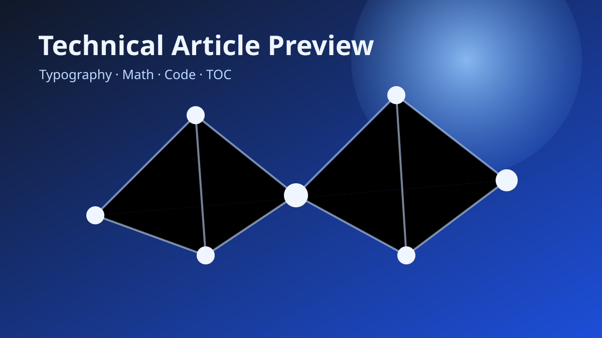

这篇文章只用于本地开发预览。它包含技术博客常见的 Markdown 元素，并且始终保持 `draft: true`。

## 1. 文本层级

正文应当保持适合长篇阅读的行高和宽度。**强调文字**、*斜体文字*、`inline_code` 与[普通链接](https://gohugo.io/)都需要在明暗主题下清晰可辨。

> 一个好的技术页面应该让结构退后，让论证和证据走到前面。

### 1.1 列表

- 模型结构决定计算路径；
- 推理引擎决定执行效率；
- 产品设计决定能力如何被使用。

1. 先定义问题；
2. 再建立可测量的基线；
3. 最后验证优化是否真实有效。

#### 1.1.1 H4 不进入目录

这个标题用于确认目录只收录 H2 和 H3，不继续展示更深层级。

## 2. 公式

行内公式 \(p(x_t \mid x_{<t})\) 应与中文基线自然对齐。

块级公式使用 Hugo 的服务端 KaTeX 渲染：

$$
\operatorname{Attention}(Q,K,V) = \operatorname{softmax}\left(\frac{QK^\top}{\sqrt{d_k}}\right)V
$$

### 2.1 长公式

\[
\mathcal{L}(\theta) = -\sum_{t=1}^{T}\log p_\theta(x_t \mid x_1,\ldots,x_{t-1})
\]

## 3. 代码

浅色主题使用单独的浅色语法配色，暗色主题沿用 PaperMod 的暗色代码块。

```python
from dataclasses import dataclass


@dataclass
class DecodeConfig:
    temperature: float = 0.8
    max_new_tokens: int = 128


def next_token(logits, config: DecodeConfig):
    scaled = logits / config.temperature
    return scaled.argmax(dim=-1)
```

### 3.1 命令行

```bash
hugo server --buildDrafts
```

## 4. 表格与图片

| 阶段 | 主要输入 | 主要输出 |
| --- | --- | --- |
| Prefill | 完整提示词 | 初始 KV Cache |
| Decode | 单个新 token | 下一个 token 的分布 |



### 4.1 页面检查项

- 右侧目录在宽屏中固定显示；
- H2/H3 条目随滚动高亮；
- 窄屏回到文章内部目录；
- 代码块可复制且明暗主题对比合理；
- 公式和表格可以横向滚动而不破坏页面。

## 5. 结语

正式内容会来自独立的文章仓库；这个页面只承担样式回归测试。
